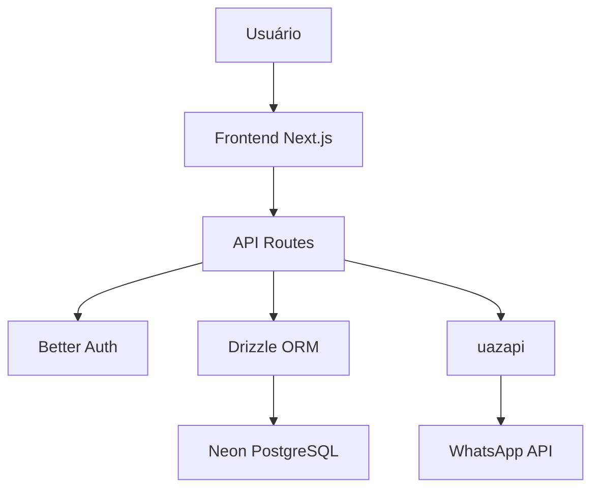

# Product Requirements Document (PRD)

## Plataforma SaaS de Disparos no WhatsApp

**Versão:** 1.0  
**Data:** Janeiro 2025  
**Status:** Em Desenvolvimento  
**Autor:** Equipe de Desenvolvimento

---

## 1. SUMÁRIO EXECUTIVO

### 1.1 Visão do Produto

A Plataforma SaaS de Disparos no WhatsApp é uma solução completa que permite a pequenos e médios empresários brasileiros utilizarem o WhatsApp como canal de comunicação em massa, oferecendo um modelo de preço fixo e acessível em reais, com mecanismos avançados de proteção contra banimento.

### 1.2 Proposta de Valor

- **Custo Acessível**: Modelo de preço fixo mensal em reais, eliminando os custos proibitivos da API oficial
- **Segurança Anti-Banimento**: Múltiplos mecanismos de proteção integrados
- **Simplicidade**: Interface 100% self-service com experiência "plug-and-play"
- **Escalabilidade**: Suporte a múltiplas instâncias e campanhas simultâneas

### 1.3 Objetivos de Negócio

- Validar a plataforma em produção em 6 meses
- Alcançar pelo menos 1 cliente ativo com >5.000 mensagens/mês
- Manter 0% de incidentes de banimento
- Atingir 10 clientes pagantes em 3 meses

---

## 2. ANÁLISE DO MERCADO

### 2.1 Problema Identificado

**Trilema dos Pequenos e Médios Empresários:**

1. **WhatsApp Web Manual**: Lento, não escalável, propenso a erros
2. **Plataformas de Baixo Custo**: Levam ao banimento, suporte inexistente
3. **API Oficial**: Custos proibitivos em dólar, regras rígidas

### 2.2 Impacto do Problema

- Ineficiência operacional
- Perda de oportunidades de venda
- Risco de perda do ativo de marketing (número WhatsApp)
- Compressão de margens de lucro

### 2.3 Mercado-Alvo

**Segmento Primário:** Franqueados de Varejo

- Exemplo: Grupo Boticário
- Necessidade: Marketing ativo com custos controlados
- Fluxo: Exportação manual de contatos → Gerenciamento → Campanhas

**Segmentos Secundários:**

- Varejistas independentes
- Prestadores de serviços
- Pequenas e médias empresas

---

## 3. REQUISITOS FUNCIONAIS

### 3.1 Gestão de Contatos

| ID    | Funcionalidade         | Descrição                                            | Prioridade |
| ----- | ---------------------- | ---------------------------------------------------- | ---------- |
| RF001 | Importação CSV         | Upload e processamento de arquivos CSV com validação | Alta       |
| RF002 | Organização em Listas  | Criação e gerenciamento de listas de contatos        | Alta       |
| RF003 | Validação de Números   | Verificação de formato e validade dos números        | Alta       |
| RF004 | Duplicação de Contatos | Detecção e tratamento de contatos duplicados         | Média      |
| RF005 | Exportação de Contatos | Download de listas em formato CSV                    | Média      |

### 3.2 Sistema de Campanhas

| ID    | Funcionalidade         | Descrição                                        | Prioridade |
| ----- | ---------------------- | ------------------------------------------------ | ---------- |
| RF006 | Criação de Campanhas   | Interface para criação de campanhas de texto     | Alta       |
| RF007 | Agendamento            | Sistema de agendamento com calendário            | Alta       |
| RF008 | Variações de Mensagem  | Geração automática de variações para evitar spam | Alta       |
| RF009 | Controle de Velocidade | Limites de envio por minuto/hora                 | Alta       |
| RF010 | Pausa/Retomada         | Controles para pausar e retomar campanhas        | Média      |
| RF011 | Preview de Mensagem    | Visualização antes do envio                      | Média      |

### 3.3 Gerenciamento de Instâncias

| ID    | Funcionalidade          | Descrição                                      | Prioridade |
| ----- | ----------------------- | ---------------------------------------------- | ---------- |
| RF012 | Conexão WhatsApp        | Integração com uazapi para conectar instâncias | Alta       |
| RF013 | Múltiplas Instâncias    | Suporte a várias contas WhatsApp simultâneas   | Alta       |
| RF014 | Status de Conexão       | Monitoramento do status das instâncias         | Alta       |
| RF015 | Gerenciamento de Tokens | Armazenamento seguro de tokens de acesso       | Alta       |
| RF016 | Teste de Conexão        | Validação de conectividade das instâncias      | Média      |

### 3.4 Relatórios e Analytics

| ID    | Funcionalidade           | Descrição                               | Prioridade |
| ----- | ------------------------ | --------------------------------------- | ---------- |
| RF017 | Dashboard Principal      | Visão geral de campanhas e estatísticas | Alta       |
| RF018 | Relatório de Entregas    | Status de entrega por campanha          | Alta       |
| RF019 | Métricas de Performance  | Taxa de entrega, leitura, resposta      | Alta       |
| RF020 | Histórico de Campanhas   | Log completo de campanhas executadas    | Média      |
| RF021 | Exportação de Relatórios | Download de relatórios em PDF/Excel     | Baixa      |

### 3.5 Sistema de Autenticação

| ID    | Funcionalidade     | Descrição                       | Prioridade |
| ----- | ------------------ | ------------------------------- | ---------- |
| RF022 | Login Google OAuth | Autenticação via Google         | Alta       |
| RF023 | Perfil de Usuário  | Gerenciamento de dados pessoais | Média      |
| RF024 | Logout Seguro      | Encerramento seguro de sessão   | Alta       |

---

## 4. REQUISITOS NÃO-FUNCIONAIS

### 4.1 Performance

- **Tempo de Resposta**: < 2 segundos para operações básicas
- **Throughput**: Suporte a 1000+ mensagens por minuto
- **Disponibilidade**: 99.5% uptime
- **Escalabilidade**: Suporte a 100+ usuários simultâneos

### 4.2 Segurança

- **Criptografia**: Dados sensíveis criptografados em trânsito e repouso
- **Autenticação**: OAuth 2.0 com Google
- **Autorização**: Controle de acesso baseado em usuário
- **Logs de Auditoria**: Registro de todas as ações críticas

### 4.3 Usabilidade

- **Interface Responsiva**: Compatível com desktop, tablet e mobile
- **Tempo de Aprendizado**: < 30 minutos para primeira campanha
- **Acessibilidade**: Conformidade com WCAG 2.1 AA
- **Idioma**: Interface 100% em português brasileiro

### 4.4 Confiabilidade

- **Backup**: Backup automático diário dos dados
- **Recuperação**: RTO < 4 horas, RPO < 1 hora
- **Monitoramento**: Alertas em tempo real para falhas críticas
- **Validação**: Testes automatizados com cobertura > 80%

---

## 5. ARQUITETURA TÉCNICA

### 5.1 Stack Tecnológica

```
Frontend:
- Next.js 15 (App Router)
- TypeScript
- Tailwind CSS
- shadcn/ui
- React Hook Form

Backend:
- Next.js API Routes
- Drizzle ORM
- Neon (PostgreSQL Serverless)
- Better Auth

Integrações:
- uazapi (WhatsApp)
- Google OAuth
- OpenAI (futuro)
```

### 5.2 Arquitetura de Dados

**Banco de Dados:** Neon (PostgreSQL Serverless)
- **Vantagens:** 
  - Escalabilidade automática (0 a 100% CPU)
  - Backup automático e point-in-time recovery
  - Conexões serverless (cold start < 1s)
  - Branching para desenvolvimento/teste
  - Custo baseado em uso real
- **Região:** Brasil (São Paulo) para baixa latência
- **Plano:** Inicial gratuito (3GB), escalável conforme demanda
- **Compatibilidade:** 100% PostgreSQL 15+ com Drizzle ORM

```sql
-- Tabelas Principais
users (id, email, name, created_at)
instances (id, user_id, name, token, status, created_at)
contacts (id, user_id, name, phone, list_id, created_at)
campaigns (id, user_id, name, message, status, scheduled_at, created_at)
campaign_contacts (id, campaign_id, contact_id, status, sent_at)
```

### 5.3 Fluxo de Dados



---

## 6. MÉTRICAS DE SUCESSO

### 6.1 KPIs de Negócio

| Métrica                 | Meta    | Período     |
| ----------------------- | ------- | ----------- |
| Clientes Ativos         | 10      | 3 meses     |
| Mensagens/Mês           | >5.000  | Por cliente |
| Taxa de Retenção        | >80%    | Mensal      |
| Incidentes de Banimento | 0       | Contínuo    |
| Tempo para 1º Disparo   | <30 min | Por usuário |

### 6.2 Métricas Técnicas

| Métrica             | Meta   | Monitoramento |
| ------------------- | ------ | ------------- |
| Uptime              | >99.5% | Tempo real    |
| Tempo de Resposta   | <2s    | P95           |
| Taxa de Erro        | <1%    | Por endpoint  |
| Cobertura de Testes | >80%   | CI/CD         |

### 6.3 Métricas de Usuário

| Métrica              | Meta    | Método          |
| -------------------- | ------- | --------------- |
| NPS                  | >50     | Pesquisa mensal |
| Tempo de Aprendizado | <30 min | Analytics       |
| Taxa de Conversão    | >15%    | Trial → Pago    |
| Suporte              | <24h    | SLA             |

---

## 7. ROADMAP DE DESENVOLVIMENTO

### 7.1 MVP (3 meses)

**Fase 1 - Fundação (Mês 1)**

- [ ] Sistema de autenticação
- [ ] Gestão básica de contatos
- [ ] Conexão com uazapi
- [ ] Interface básica

**Fase 2 - Core Features (Mês 2)**

- [ ] Criação de campanhas
- [ ] Sistema de agendamento
- [ ] Mecanismos anti-banimento
- [ ] Dashboard básico

**Fase 3 - Polimento (Mês 3)**

- [ ] Relatórios de entrega
- [ ] Múltiplas instâncias
- [ ] Testes e otimizações
- [ ] Deploy em produção

### 7.2 Pós-MVP (6 meses)

**Fase 4 - Automação**

- [ ] Templates de mensagem
- [ ] Fluxos de reengajamento
- [ ] Integração com CRMs
- [ ] API pública

**Fase 5 - Inteligência**

- [ ] Sugestões de IA
- [ ] Análise de sentimentos
- [ ] Otimização automática
- [ ] Webhooks

---

## 8. RISCOS E MITIGAÇÕES

### 8.1 Riscos Técnicos

| Risco                | Probabilidade | Impacto | Mitigação            |
| -------------------- | ------------- | ------- | -------------------- |
| Instabilidade uazapi | Média         | Alto    | Múltiplos provedores |
| Mudanças WhatsApp    | Baixa         | Crítico | Monitoramento ativo  |
| Limitações Neon      | Baixa         | Baixo   | Escalabilidade automática |

### 8.2 Riscos de Negócio

| Risco                    | Probabilidade | Impacto | Mitigação               |
| ------------------------ | ------------- | ------- | ----------------------- |
| Concorrência API Oficial | Média         | Alto    | Diferenciação por preço |
| Mudanças regulatórias    | Baixa         | Alto    | Compliance ativo        |
| Dependência de terceiros | Alta          | Médio   | Contratos e SLAs        |

---

## 9. CRITÉRIOS DE ACEITAÇÃO

### 9.1 MVP Ready

- [ ] 10 clientes conseguem criar e executar campanhas
- [ ] 0 incidentes de banimento em 30 dias
- [ ] Tempo médio para primeira campanha < 30 minutos
- [ ] Uptime > 99% por 30 dias consecutivos

### 9.2 Production Ready

- [ ] Suporte a 100+ usuários simultâneos
- [ ] Processamento de 10.000+ mensagens/dia
- [ ] Tempo de resposta < 2s para 95% das requisições
- [ ] Backup e recuperação testados

---

## 10. APÊNDICES

### 10.1 Glossário

- **uazapi**: Serviço de terceiros para integração com WhatsApp
- **Neon**: Plataforma PostgreSQL serverless para banco de dados
- **Instância**: Conexão individual com uma conta WhatsApp
- **Campanha**: Conjunto de mensagens enviadas para uma lista de contatos
- **Banimento**: Bloqueio permanente de uma conta WhatsApp pelo Meta

### 10.2 Referências

- [Project Brief](./Project_Brief.md)
- [Documentação uazapi](https://uazapi.com/docs)
- [WhatsApp Business API](https://developers.facebook.com/docs/whatsapp)
- [Next.js Documentation](https://nextjs.org/docs)

---

**Documento aprovado por:** Equipe de Desenvolvimento  
**Próxima revisão:** Fevereiro 2025  
**Versão:** 1.0
